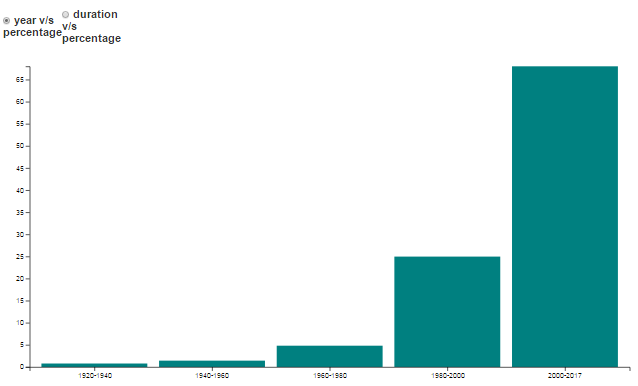

# Movie Insights of IMDB

This project was done as a part of course to visualize previous 25 years of IMDB data for Information Visualization course.

**Following is the link explaining the features of the project** - [Video](https://www.youtube.com/watch?v=KR-PofeezYI&feature=youtu.be)

**Click On the following link for** - [LiveDemo](http://www.cs.odu.edu/~nmalapati/Infovis/bubble_logic.html)

## Abstract

we present the visualization and analysis of the movies that have the total user votes more than 25,000. The data set for the movies are collected from the IMDB website by running the python script. A total of 22,000 movies are visualized and an analysis is made on the results obtained. Simple interactive system is developed for the user to make analysis between various movies. The statistics for different movie attributes are obtained and visualization of data is performed. Major insights are discussed.

## Data Collection:

the dataset is obtained by running the python script called beautiful soup which is an efficient way to crawl the data from any website. Besides, the dataset is refined enough, where potential duplicates are removed and a structured and cleaner data is used for the visualization purposes

## DATA SET PREPARATION

### Data Extraction:

The data has been extracted from the website http://www.imdb.com by running the python script. The library in python used for this purpose is called ‘beautiful soup’. The method adopted to extract the data from the subjected website is called as data crawling.

### Data Refining:

The data thus obtained from the above process (Data crawling) may have many redundancies and dirty data which may lead to faulty data visualization at times. Hence, the data set has to undergo a process of refining in order to find possible discrepancies in the data and also potential duplicates to avoid the redundancies. 

### Data Analysis:

The raw data thus obtained is converted into JSON format using the online JSON converter. The dataset consists of the movies between 1915 and 2017. All the anomalies in the data have been excluded. It should be noted that, only the movies which have received the user votes greater than 25000 votes have been collected. 

## Plots used to visualize data

**1. Bubble Chart**

This is a main view as most of the users consider genre as an important criteria to decide whether to watch it or not. Here we plot the Bubble chart for different genres based on the country filter provided at the top of the home page. All the data is in the file names “data.json” file. 

**2. Filtering**

The data can be filtered according to the country selected to obtain the bubble chart view for the different genres of movies that are available that are produced by that country. This will help in identifying the country and language of the movie that the user is interested to watch.

**3. Circle Packing**

Here, the filtering is provided to categorize the movies based on either the star cast or the director. Thus all the movies in the selected genre is pooled in different child circles inside the parent circle based on the rating obtained. This data is again sub divided and data is pooled in circles based on either the Actor or a Director in a certain rating range of the movie.

**4. Bar Graph**

The Bar graphs are drawn to compare and contrast the important movie characteristics such as the percentage of movies in a selected genre that come under a certain range of years and also a bar graph showing the percentage of movies in a given range of duration. This will help the user to understand the trends that different genres of movies are following over the years. Some interesting comparisons like rise or fall of number of movies in a certain range of years can be made for all available genres.

**5. Line Graph**

Once the country is selected using the country filter a line chart displaying the trends for the data between 1990 and 2016 for the number of movies produced by that country over the years is generated which gives us some useful information. Several useful insights can be taken from the graph.
One of the important observations that can be made include, how the number of movies over the years increased. Several comparisons can be drawn out between various genres or the same genre for different countries.

**Several other plots were used to visualize the data which were discussed in detail in the Report**

